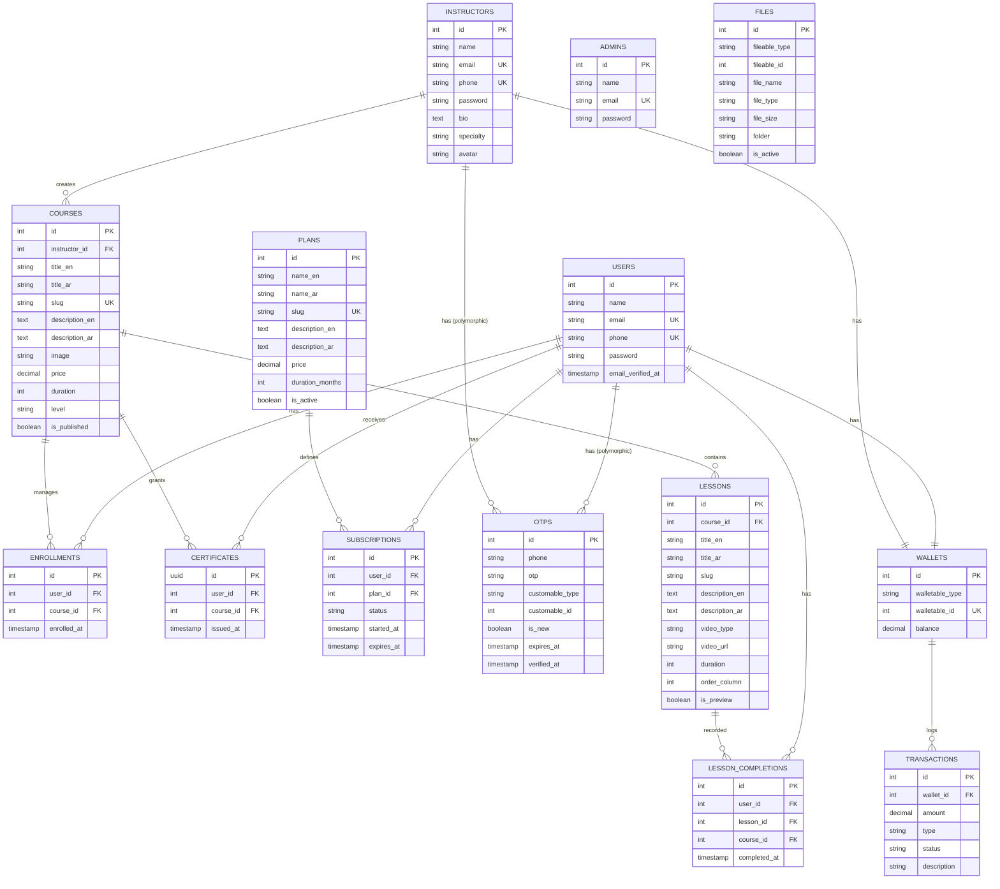

# Entity Relationship Diagram

```mermaid
erDiagram
    USERS ||--o{ ENROLLMENTS : "has"
    USERS ||--o{ LESSON_COMPLETIONS : "has"
    USERS ||--o{ CERTIFICATES : "receives"
    USERS ||--o{ SUBSCRIPTIONS : "has"
    USERS ||--o{ OTPS : "has (polymorphic)"
    USERS ||--|| WALLETS : "has"
    
    INSTRUCTORS ||--o{ COURSES : "creates"
    INSTRUCTORS ||--o{ OTPS : "has (polymorphic)"
    INSTRUCTORS ||--|| WALLETS : "has"
    
    COURSES ||--o{ LESSONS : "contains"
    COURSES ||--o{ ENROLLMENTS : "manages"
    COURSES ||--o{ CERTIFICATES : "grants"
    
    LESSONS ||--o{ LESSON_COMPLETIONS : "recorded"
    
    PLANS ||--o{ SUBSCRIPTIONS : "defines"
    
    WALLETS ||--o{ TRANSACTIONS : "logs"

    USERS {
        int id PK
        string name
        string email UK
        string phone UK
        string password
        timestamp email_verified_at
    }

    INSTRUCTORS {
        int id PK
        string name
        string email UK
        string phone UK
        string password
        text bio
        string specialty
        string avatar
    }

    ADMINS {
        int id PK
        string name
        string email UK
        string password
    }

    COURSES {
        int id PK
        int instructor_id FK
        string title_en
        string title_ar
        string slug UK
        text description_en
        text description_ar
        string image
        decimal price
        int duration
        string level
        boolean is_published
    }

    LESSONS {
        int id PK
        int course_id FK
        string title_en
        string title_ar
        string slug
        text description_en
        text description_ar
        string video_type
        string video_url
        int duration
        int order_column
        boolean is_preview
    }

    ENROLLMENTS {
        int id PK
        int user_id FK
        int course_id FK
        timestamp enrolled_at
    }

    LESSON_COMPLETIONS {
        int id PK
        int user_id FK
        int lesson_id FK
        int course_id FK
        timestamp completed_at
    }

    CERTIFICATES {
        uuid id PK
        int user_id FK
        int course_id FK
        timestamp issued_at
    }

    PLANS {
        int id PK
        string name_en
        string name_ar
        string slug UK
        text description_en
        text description_ar
        decimal price
        int duration_months
        boolean is_active
    }

    SUBSCRIPTIONS {
        int id PK
        int user_id FK
        int plan_id FK
        string status
        timestamp started_at
        timestamp expires_at
    }

    WALLETS {
        int id PK
        string walletable_type
        int walletable_id UK
        decimal balance
    }

    TRANSACTIONS {
        int id PK
        int wallet_id FK
        decimal amount
        string type
        string status
        string description
    }

    OTPS {
        int id PK
        string phone
        string otp
        string customable_type
        int customable_id
        boolean is_new
        timestamp expires_at
        timestamp verified_at
    }

    FILES {
        int id PK
        string fileable_type
        int fileable_id
        string file_name
        string file_type
        string file_size
        string folder
        boolean is_active
    }
```
